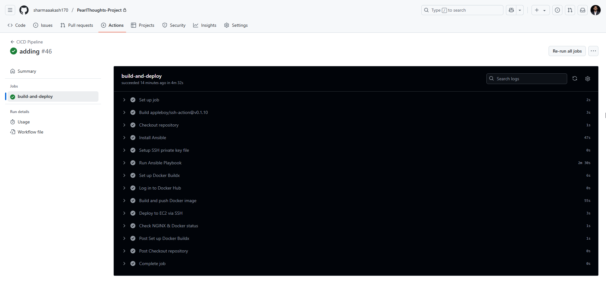
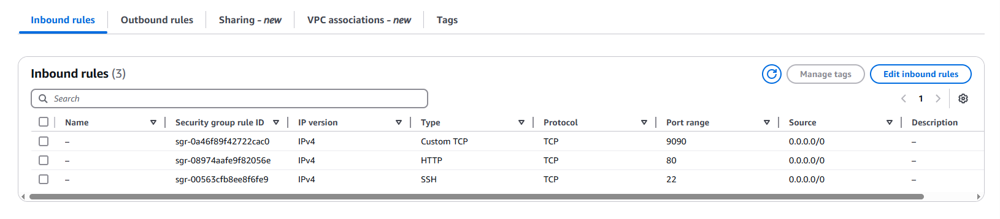
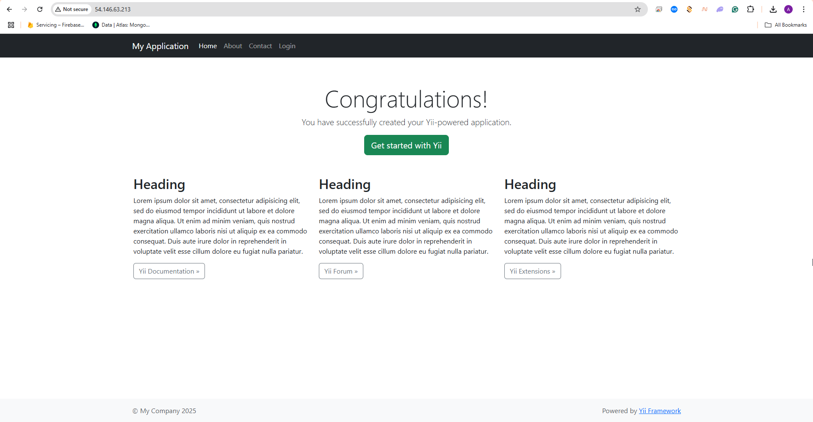
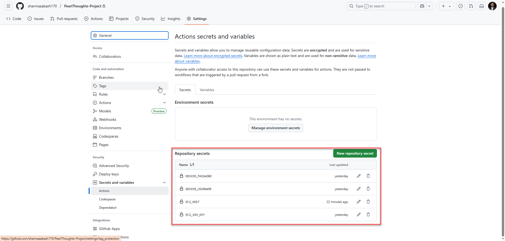
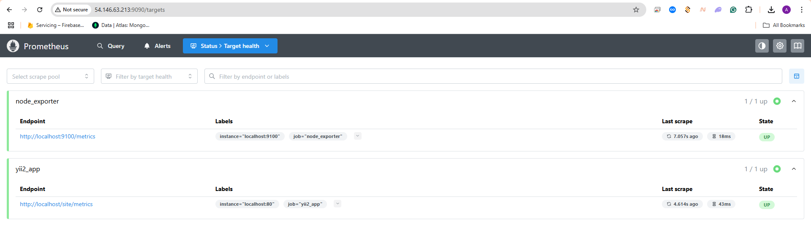

# Yii2 PHP Application Deployment with Docker, Ansible, and GitHub Actions

This repository contains a complete setup for deploying a Yii2 PHP application using Docker-Swarm, NGINX, and Ansible on an AWS EC2 instance. CI/CD is handled via GitHub Actions.

## 📁 Repository Structure

```
├── yii2-app/
│   └── Dockerfile
├── docker-swarm/
│   └── deploy.yaml
├── ansible/
|   ├── inventory.ini
│   └── playbook.yaml
├── nginx/
│   └── default.conf
├── .github/
│   └── workflows/
│       └── cicd.yaml
├── README.md
```

## 🚀 Setup Instructions

1. **Clone the repository**:

```bash
git clone https://github.com/sharmaaakash170/PearlThoughts-Project.git
cd PearlThoughts-Project
```

2. **Configure GitHub Secrets**:

- `EC2_SSH_KEY`: Your SSH private key to access the EC2 instance.
- `EC2_HOST`: Public IP or DNS of the EC2 instance.
- `DOCKER_USERNAME` and `DOCKER_PASSWORD` (if pushing to DockerHub).

3. **Deploy via GitHub Actions**:

Push to the main branch and GitHub Actions will automatically trigger the deployment workflow defined in `.github/workflows/cicd.yaml`.


4. **Ansible Playbook will run automatically via Github Actions**:
   Implemented rollback on failure functionality in Github Actions pipeline
```bash
ansible-playbook -i inventory ansible/playbook.yaml
```

## 🛠️ Assumptions

- The EC2 instance is already provisioned and has Docker and Ansible installed.
- The security group allows SSH and HTTP(S) traffic.
- DNS is already pointed to the EC2 instance if using domain-based routing.


## ✅ Testing the Deployment

After deployment, navigate to your EC2 instance’s IP or domain in a browser:

```
http://<your-ec2-ip>
```



## 🔐 GitHub Secrets

All sensitive data like SSH keys and environment variables are stored securely in GitHub Secrets.


## ❤️ Bonus Features

- **Health Checks**: Configured in `Dockerfile` for the app containers.
- **Monitoring**: Prometheus and Node Exporter containers included for basic monitoring. Go to below URL to check the health of the target-
```bash
http://<your-ec2-ip>:9090/targets
```


---

Maintained by [Aakash Sharma]
